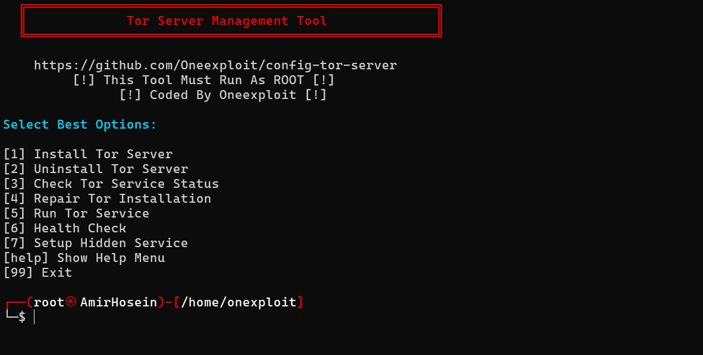

# 🚀 Tor Management Toolkit  

<p align="center">
  
</p>

---

## ✨ Overview

This is an **advanced Bash script** designed to easily install, manage, troubleshoot, and use the **Tor service**.  
With this toolkit, you can quickly install Tor, check its status, repair common issues, run it interactively, and even create your own **Hidden Services**.

---

## 🔥 Features

- 📦 **Install/Uninstall Tor** with one command  
- 🔍 Check Tor service status  
- 🛠 **Smart Repair Mode**:
  - Verify and sync system time with UTC
  - Validate `torrc` configuration
  - Restore from backup if needed
  - Fix DataDirectory permissions
  - Detect if bridges are required  
- 📡 Run Tor and monitor bootstrap progress until 100%  
- ✅ **Health Check** to confirm your traffic is routed over Tor  
- 🕵️ Setup and manage new **Hidden Services**  
- 🗂 Shell-like commands:  
  - `cd` to navigate directories  
  - `ls` to list files  
  - `clear` to clean the terminal  
- 🎨 Interactive CLI with custom prompt and colors  

---

## ⚡️ Quick Start

### 1. Clone or download:
```bash
git clone https://github.com/YourUsername/tor-management-toolkit.git
cd tor-management-toolkit
````

### 2. Make the script executable:

```bash
chmod +x install.sh
```

### 3. Run:

```bash
sudo ./install.sh
```

---

## 🎮 Available Commands

| Command                | Description                     |
| ---------------------- | ------------------------------- |
| `1` / `install tor`    | Install Tor service             |
| `2` / `uninstall tor`  | Uninstall Tor service           |
| `3` / `status tor`     | Check Tor service status        |
| `4` / `repair`         | Repair Tor installation         |
| `5` / `run tor`        | Run Tor and show bootstrap logs |
| `6` / `health`         | Run a Tor health check          |
| `7` / `hidden service` | Create a new Hidden Service     |
| `cd <path>`            | Change working directory        |
| `ls`                   | List files in current directory |
| `clear`                | Clear the screen                |
| `99` / `exit`          | Exit the script                 |

---

## 🖼 Preview

Screenshot of the interactive CLI in action:

<p align="center">
  
</p>

---

## 💡 Notes

* The script must be run with **root or sudo privileges**.
* `curl` is required for the **health check** feature.
* If Tor is blocked in your region, Repair Mode will notify you and guide you to use **Bridges**.

---

## 🤝 Contribution

Got ideas or improvements? Feel free to open an **Issue** or submit a **Pull Request** 🚀

---

## ⚠️ Disclaimer

This toolkit is provided for **educational and security research purposes only**.
Any misuse or illegal activity is the sole responsibility of the user.
